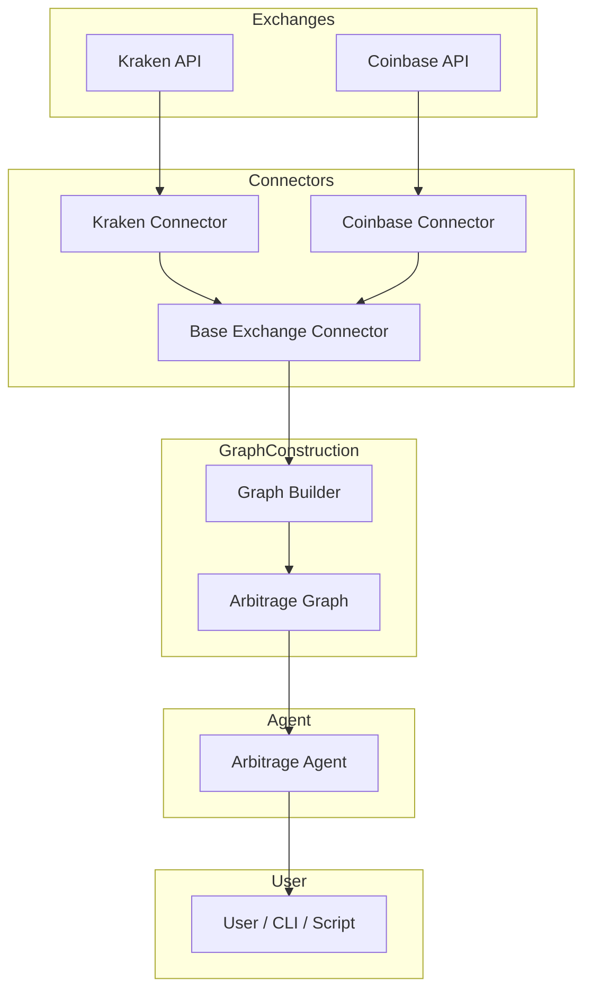
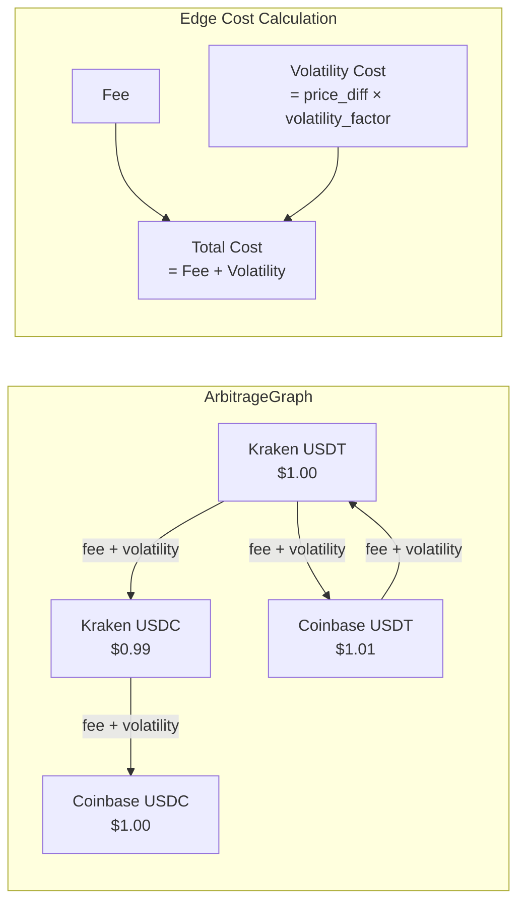
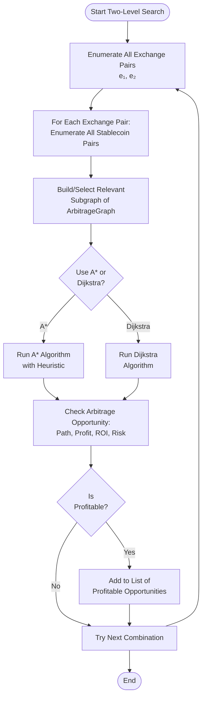

# StableCoin Cross-Exchange Arbitrage

A robust Python framework for cross-exchange stablecoin arbitrage, implementing advanced graph search algorithms (two-level, Dijkstra, A*) over live market data (Kraken/Coinbase) to detect and evaluate profitable arbitrage cycles. Developed as part of a CMPT 417/827 research project at SFU.

## Features

- **Graph-Based Modeling**: Models the arbitrage environment as a directed weighted graph
- **Multiple Algorithms**: Implements Dijkstra's algorithm and A* search with volatility/time heuristics
- **Two-Level Search**: Systematically compares all stablecoin pairs across all exchanges
- **Live API Integration**: Connects to Kraken and Coinbase APIs for real-time price data
- **Synthetic Testing**: Includes generators for synthetic and adversarial test instances
- **Comprehensive Analysis**: Experiment scripts for performance comparison and evaluation

## System Architecture

### High-Level Architecture



### Graph and Cost Model



### Two-Level Search and Agent Workflow



**Cost Function Formula:**
```
Total Edge Cost = Fee + Volatility Cost
where:
  Volatility Cost = |price_source - price_target| × volatility_factor
  Fee = transaction_fee + withdrawal_fee
```

**Arbitrage Condition:**
```
Price Difference > Total Cost
i.e., |P_target - P_source| > (Fee + Volatility Cost)
```

## Installation

1. Clone the repository:
```bash
git clone <repository-url>
cd Stablecoin-CrossExchange-Arbitrage
```

2. Install dependencies:
```bash
pip install -r requirements.txt
```

## Project Structure

```
Stablecoin-CrossExchange-Arbitrage/
├── src/
│   ├── models/              # Data models (ExchangeNode, Edge, Graph)
│   ├── connectors/          # Exchange API connectors
│   ├── algorithms/          # Search algorithms (Dijkstra, A*, two-level)
│   ├── arbitrage_agent.py   # Main agent class
│   ├── graph_builder.py     # Graph construction utilities
│   └── synthetic_generator.py  # Synthetic instance generators
├── experiments/             # Experiment scripts
├── data/                    # Data storage directory
├── requirements.txt         # Python dependencies
└── README.md               # This file
```

## Quick Start

### Basic Usage with Synthetic Data

```python
from src import ArbitrageAgent
from src.synthetic_generator import generate_synthetic_graph

# Generate a synthetic graph
graph = generate_synthetic_graph(num_exchanges=4, num_stablecoins=3)

# Create arbitrage agent
agent = ArbitrageAgent(graph)

# Find arbitrage opportunities
opportunities = agent.find_all_opportunities(algorithm='astar', max_depth=5)

# Display results
for path, profit, cost, desc in opportunities[:5]:
    print(f"{desc}: Profit=${profit:.4f}, Cost=${cost:.4f}")
```

### Using Live API Data

```python
from src import ArbitrageAgent, GraphBuilder, KrakenConnector, CoinbaseConnector

# Create connectors
kraken = KrakenConnector()
coinbase = CoinbaseConnector()

# Build graph from live data
builder = GraphBuilder()
builder.add_connector(kraken)
builder.add_connector(coinbase)
graph = builder.build_graph()

# Find opportunities
agent = ArbitrageAgent(graph)
opportunities = agent.find_all_opportunities(algorithm='astar')
```

## Algorithms

### Dijkstra's Algorithm
Finds the least-cost path through the arbitrage graph. Suitable for scenarios where cost minimization is the primary concern.

### A* Search
Extends Dijkstra's with a volatility/time heuristic that estimates future risk. Performs better in volatile markets and large-scale scenarios.

### Two-Level Search
Systematically explores all pairs of stablecoins across all pairs of exchanges, ensuring comprehensive coverage of arbitrage opportunities.

## Running Experiments

### Basic Experiment
```bash
python experiments/basic_experiment.py
```

This runs:
- Synthetic graph experiments
- Adversarial instance tests
- Live API experiments (if available)

### Performance Comparison
```bash
python experiments/performance_comparison.py
```

Compares performance of different algorithms across multiple runs.

### Example Usage
```bash
python example_usage.py
```

Demonstrates basic usage patterns with both synthetic and live data.

## Mathematical Formulation

The arbitrage environment is modeled as a directed graph G = (V, E):

- **Nodes** v ∈ V represent (exchange, stablecoin) pairs
- **Edges** e = (v_i, v_j) represent transfer possibilities
- **Edge weights** W_ij = f_fee + f_vol(t) represent total transfer costs

An arbitrage opportunity exists when:
```
Δ_ij = P_vi - P_vj > W_ij
```

Where P_vi is the price at node i and W_ij is the transfer cost.

## API Integration

### Supported Exchanges
- **Kraken**: Public API for price data
- **Coinbase**: Public API for price data

### Rate Limiting
Both connectors implement rate limiting to respect API constraints. Default: 1 request per second.

### Error Handling
Connectors gracefully handle API errors and network issues, returning None when data is unavailable.

## Synthetic Instance Generation

The system includes generators for:
- **Standard instances**: Controlled parameters for testing
- **Adversarial instances**: High volatility, asymmetric fees, illiquid markets

Example:
```python
from src.synthetic_generator import generate_adversarial_instance

graph = generate_adversarial_instance(
    num_exchanges=4,
    high_volatility=True,
    asymmetric_fees=True
)
```

## Performance Metrics

The system tracks:
- Number of arbitrage opportunities found
- Cumulative simulated profit
- Computational time
- Solution optimality

## Limitations

- Network and rate limits affect live API experiments
- Simplified fee structures (can be customized)
- Synthetic instances are used for stability in testing
- Real trading requires additional considerations (liquidity, slippage, etc.)

## Future Work

- Support for DEXs (decentralized exchanges)
- Multi-agent strategies
- Continual learning for risk mitigation
- Real-time portfolio adjustments
- Advanced volatility modeling

## References

Based on research from:
- BlockApps, "Mastering Cross-Exchange Arbitrage with Stablecoins," 2024
- N. Author, "Arbitrage among Stablecoins," Clemson University Thesis, 2022
- Group 39, "Recursive MA-CBS," CMPT 417 Undergraduate Sample Report (2021)

## License

See LICENSE file for details.

## Contributing

This is a research project. For questions or contributions, please contact the project maintainers.
